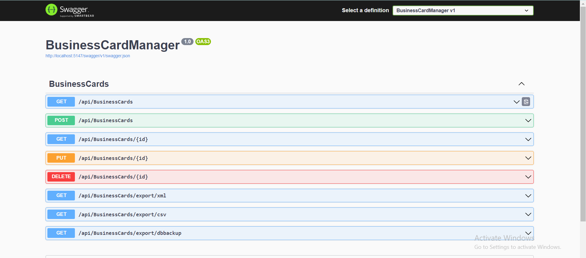
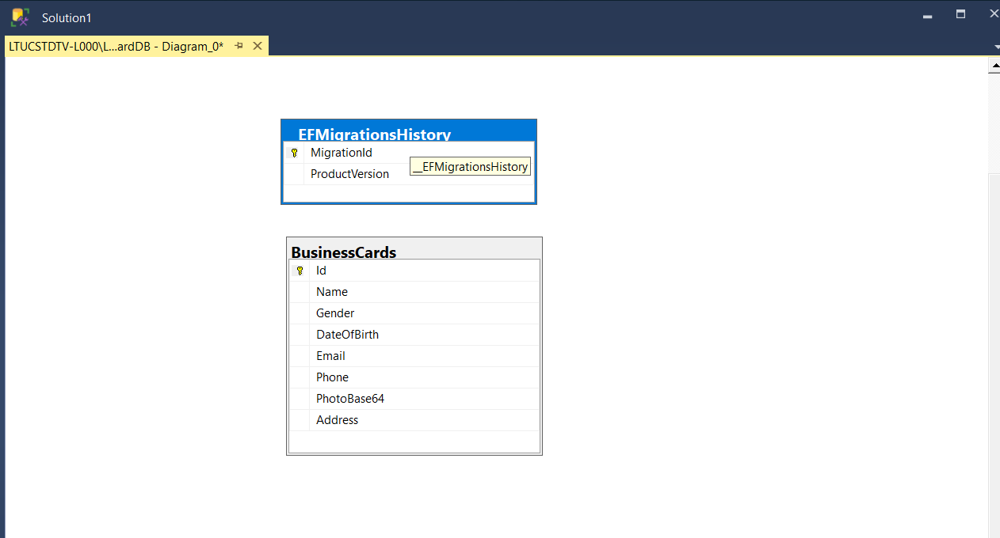
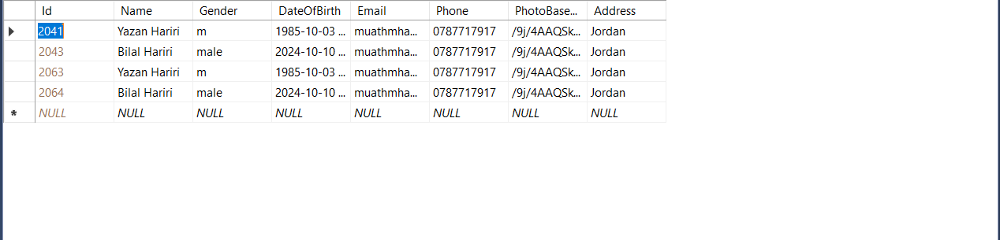

# 📇 BusinessCardManager

BusinessCardManager is a robust web application designed for managing business cards, allowing users to perform CRUD (Create, Read, Update, Delete) operations efficiently. Built using **ASP.NET Core** and **Entity Framework Core**, this application follows best practices, including the **Repository Design Pattern** and **SOLID principles**, ensuring clean architecture and maintainability.

---
## 🚀 Demo

You can view the live Swagger demo of the **BusinessCardManager** application at the following link:

[BusinessCardManager Demo](http://businesscards.runasp.net/)

## 🛠️ Deployment

This application is deployed using **MonesterASP.net**, a reliable hosting service for ASP.NET applications. For more information on how to deploy your ASP.NET applications, visit the following link:

[MonesterASP.net](https://monesterasp.net/)

## 📋 Table of Contents

1. [✨ Features](#features)
2. [🏗️ Architecture](#architecture)
3. [⚙️ Setup Instructions](#setup-instructions)
4. [📖 Usage Guidelines](#usage-guidelines)
5. [🧪 Unit Testing](#unit-testing)
6. [📜 Swagger Documentation](#swagger-documentation)
7. [🗂️ Database Diagram](#database-diagram)
8. [📝 Conclusion](#conclusion)

---

## ✨ Features

- **CRUD Operations**: 
  - Create new business cards with user data including name, gender, email, phone number, and address.
  - Read business cards with options to filter by name or retrieve specific entries by ID.
  - Update existing business card details.
  - Delete business cards from the database.

- **File Import**:
  - Import business card data from XML and CSV files seamlessly.

- **File Export**:
  - Export business card data in both XML and CSV formats.

- **Database Backup**:
  - Generate a backup of the SQL Server database to a specified location.

- **QR Code Parsing**:
  - Add business cards directly from QR code data encoded in JSON format.

---

## 🏗️ Architecture

The application is structured around the **Repository Design Pattern**, which helps separate the data access logic from the business logic, promoting cleaner code and easier testing. The main components of the architecture are:

- **Controllers**: Handle HTTP requests and return responses. They use the service layer for business operations.
- **Services**: Implement the business logic and interact with the database context.
- **Models**: Define the structure of business cards and Data Transfer Objects (DTOs).
- **Data Access**: Entity Framework Core is used to interact with the SQL Server database.

This architecture adheres to **SOLID principles**, ensuring that the codebase is maintainable, scalable, and testable.

---

## ⚙️ Setup Instructions
1. **Clone the Repository**:
   ```bash
   git clone https://github.com/muathmm/BusinessCardApp.git
   cd BusinessCardManager
   
2. **Install Dependencies: Run the following command to restore the project's dependencies:**:
   ```bash
   dotnet restore
   
3. **Configure Database:**Open appsettings.json and ensure the connection string is set correctly

   ```bash 
    "ConnectionStrings": {
    "DefaultConnection": "Server=(localdb)\\MSSQLLocalDB;Database=BusinessCardDB;Trusted_Connection=true;TrustServerCertificate=True;MultipleActiveResultSets=true"
    }
4. **Run the following command to create the database:**
  
   ```bash 
        dotnet ef database update

5. **dotnet run:**
    ```bash 
          dotnet run
**Access Swagger UI:**
After running the application, navigate to http://localhost:5000/swagger to explore API endpoints.
 

## 📖  Usage Guidelines

### 1. Create a Business Card:
Use the **POST** method at `/api/businesscards` with a JSON body to create a new card.

### 2. Retrieve Business Cards:
Use the **GET** method at `/api/businesscards` to retrieve all cards or `/api/businesscards/{id}` for a specific card.

### 3. Update a Business Card:
Use the **PUT** method at `/api/businesscards/{id}` with a JSON body to update card details.

### 4. Delete a Business Card:
Use the **DELETE** method at `/api/businesscards/{id}` to remove a card from the database.

### 5. Export Database Backup:
Access the **GET** endpoint `/api/businesscards/export/dbbackup` to generate and download a database backup.
## 🧪  Unit Testing

Unit tests are implemented using xUnit to ensure the integrity of the application's functionality. Each critical path, including data import/export and CRUD operations, is covered in the tests. We utilize **Moq** to create mock objects, allowing for the isolation of the code being tested and ensuring that dependencies do not affect the outcomes.

### Running Unit Tests
 To run the tests, navigate to the test project directory and execute:

      dotnet test

## 📜  Swagger Documentation

Swagger is integrated into the application to provide a user-friendly interface for testing API endpoints. After running the application, access Swagger UI at:

    
    http://localhost:5000/swagger

## 🗂️  Database Diagram

The database structure is designed to efficiently store business card information. Below is the database diagram representing the relationships and entities.

 
#### Cards Table
 

## 📝 Conclusion

The BusinessCardManager application offers a comprehensive solution for managing business cards with a focus on usability and extensibility. It follows modern development practices, making it a robust choice for users needing to organize their contacts efficiently.

For contributions, issues, or feature requests, feel free to create a GitHub issue or pull request. Thank you for your interest in BusinessCardManager!
